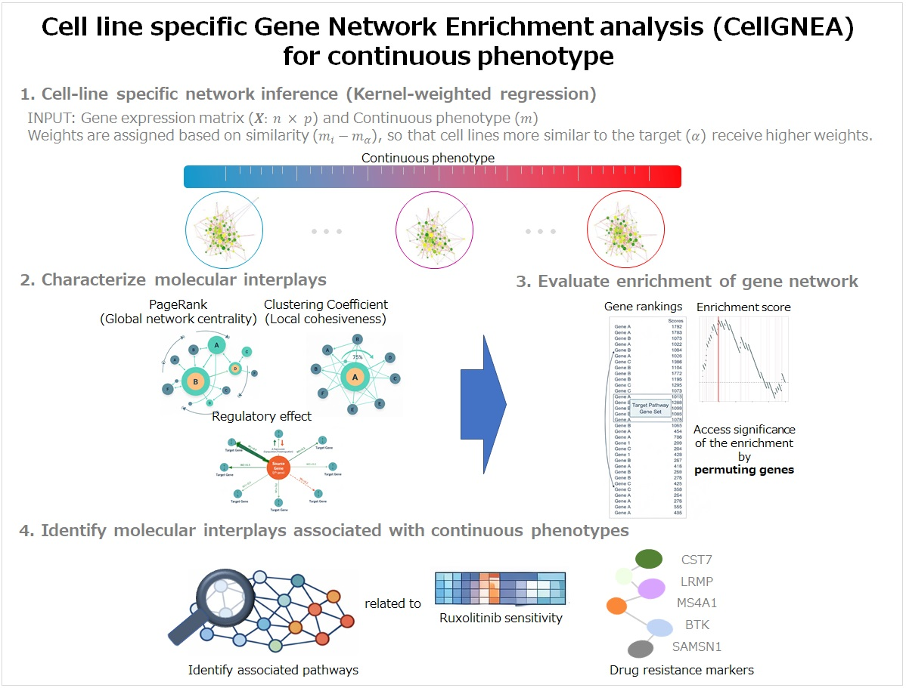

# CellGNEA

This repository contains the toy dataset and R code used in the analyses for the paper:

**"CellGNEA: Cell Line–Specific Gene Network Enrichment Analysis for Interpreting Continuous Phenotypes"**

---

## 🔬 Overview

CellGNEA is a framework designed to identify **pathway-level enrichment patterns** from **cell line–specific gene regulatory networks along a continuous phenotype** (e.g., drug response, cancer progression).

<p align="center">
  
</p>

---
**The method integrates:**
- Cell-specific network inference
- Network topology features (i.e., Clustering Coefficient, PageRank, Regulatory effects)
- Gene-level scoring
- Enrichment analysis with permutation testing

---

## 📊 Graphical Workflow

```
Input Data
 ├── Gene Expression Matrix (EXP)
 ├── Phenotype / Modulator (Modulator)
 └── Pathway Gene Set (PW_genes)

        ↓

[Step 1] Network Inference
→ Construct cell-specific gene regulatory networks based on the kernel-based L1-type regularized regression model

        ↓

[Step 2] Feature Extraction
→ Clustering Coefficient (C*)
→ PageRank
→ Regulatory Effect (RE)

        ↓

[Step 3] Gene Scoring
→ Integrate network features into gene-level scores

        ↓

[Step 4] Association Analysis
→ Correlate gene scores with phenotype

        ↓

[Step 5] Enrichment Analysis
→ Compute enrichment score (ES)
→ Permutation test → p-value

        ↓

Output
 ├── Enrichment Score (ES)
 └── Statistical Significance (p-value)
```

---

## 📁 Repository Structure

```
ToyDATA_CellGNEA/
 ├── EXP.csv
 ├── PathwayGENES.csv
 ├── Modulator.csv
 ├── BETA_Sample1.csv
 ├── BETA_Sample2.csv
 └── ...
```

---

## ⚙️ Requirements

```r
library(data.table)
library(igraph)
library(glmnet)
```

---

## 🚀 Step-by-Step Usage

### Step 0. Load Libraries & Define Functions

```r
library(data.table)
library(igraph)
library(glmnet)

ClustBCG_C_star <- function(W) {
  p <- nrow(W)
  A <- (W != 0) * 1
  W_plus_Wt <- W + t(W)
  A_plus_At <- A + t(A)
  s_tot <- rowSums(W_plus_Wt)
  d_tot <- rowSums(A_plus_At)
  s_bilat <- 0.5 * rowSums(W %*% A + A %*% W)

  A_plus_At_sq <- A_plus_At %*% A_plus_At
  Num <- 0.5 * diag(W_plus_Wt %*% A_plus_At_sq)
  Den <- s_tot * (d_tot - 1) - 2 * s_bilat

  C_star <- ifelse(Den > 0, Num / Den, 0)
  names(C_star) <- rownames(W)
  return(C_star)
}
```

---
### Step 1. Load Data

```r
EXP <- read.table("ToyDATA_CellGNEA/EXP.csv", sep=",")
PW_genes <- read.table("ToyDATA_CellGNEA/PathwayGENES.csv", sep=",")
Modulator <- read.table("ToyDATA_CellGNEA/Modulator.csv", sep=",")

T_col<-ncol(EXP)
p <- T_col
NoCELL <- nrow(Modulator)
gene_names <- colnames(EXP)

NOpm <- 1001
```

---

### Step 2. Cell-specific Network Inference

```r
FIT.M <- as.numeric(Modulator[,1])
names(FIT.M) <- rownames(Modulator)

for (i in 1:NoCELL){

  BETA1 <- matrix(0, p, p)
  colnames(BETA1) <- gene_names
  rownames(BETA1) <- gene_names

  for (t in 1:p){

    tgt <- scale(EXP[,t], TRUE, TRUE)
    rgt <- scale(EXP[,-t], TRUE, FALSE)

    H <- quantile(abs(FIT.M - FIT.M[i]), 0.75)
    K <- diag(sqrt(exp(-((FIT.M - FIT.M[i])^2)/(H^2))))

    K_rgt <- K %*% rgt
    K_tgt <- K %*% tgt

    fit <- cv.glmnet(K_rgt, K_tgt, alpha=0.5, nfolds=5)

    beta <- coef(fit, s="lambda.min")[-1]
    BETA1[colnames(rgt), colnames(EXP)[t]] <- beta
  }

  write.table(BETA1,
              paste("ToyDATA_CellGNEA\\BETA_Sample",i,".csv",sep=""),
              sep=",")
}
```

---

### Step 3. Network-Based Gene Scoring

```r
SCORE<-matrix(numeric(T_col*NoCELL),ncol=T_col)
colnames(SCORE)<-gene_names; rownames(SCORE)<-rownames(Modulator)

CORR<- matrix(numeric(T_col*1),ncol=1)
rownames(CORR)<-gene_names
for (i in 1:NoCELL){

### 3.1 Infile edge weight matrix of i-th cell line:
EdgeW<-read.table(paste("ToyDATA_CellGNEA\\BETA_Sample",i,".csv",sep=""),sep=",")

### 3.2 Clustering Coefficient in (5):
W<-EdgeW
W[]<-0
W[upper.tri(W)] <- EdgeW[upper.tri(EdgeW)]
W[lower.tri(W)] <- EdgeW[upper.tri(EdgeW)]
C_star_coefficients <- ClustBCG_C_star(as.matrix(W))
if ((max(C_star_coefficients)-min(C_star_coefficients))!=0){
nC_star_coefficients<-(C_star_coefficients-min(C_star_coefficients))/(max(C_star_coefficients)-min(C_star_coefficients))
}else if ((max(C_star_coefficients)-min(C_star_coefficients))==0){
nC_star_coefficients<-(C_star_coefficients-min(C_star_coefficients))
}

### 3.3 PageRank in (6):
g_w <- graph_from_adjacency_matrix(as.matrix(abs(W)), mode = "directed", weighted = TRUE)
pr_w <- page.rank(g_w, damping = 0.85, weights = E(g_w)$weight)
PageRank<-pr_w$vector
nPageRank<-(PageRank-min(PageRank))/(max(PageRank)-min(PageRank))
names(nPageRank)<- gsub("\\.", "-", names(nPageRank))
quantile(nPageRank)

### 3.4 Regulatory Effect in (8):
estNP<-c()
for (c in 1:ncol(EdgeW)){
if (sum(EdgeW[,c]!=0)>0){
estNP<-rbind(estNP,cbind(rownames(EdgeW)[EdgeW[,c]!=0],colnames(EdgeW)[c],EdgeW[,c][EdgeW[,c]!=0]))
}
}
estNP<-cbind(estNP,abs(as.numeric(estNP[,3])))
colnames(estNP)<-c("RG","TG","COEF","absCOEF")
rownames(estNP)<-paste(estNP[,1],"_",estNP[,2],sep="")
estNP<-cbind(estNP,t(as.numeric(estNP[,"absCOEF"])*EXP[rownames(Modulator)[i],estNP[,1]]))
colnames(estNP)[5]<-"RE"
dt <- as.data.table(estNP)
result <- dt[, .(RE_sum = sum(as.numeric(RE), na.rm = TRUE)), by = RG]
mat_result <- as.matrix(result)
RE<-matrix(numeric(p*1),ncol=1)
rownames(RE)<-gene_names
RE[mat_result[,1],1]<-as.matrix(as.numeric(mat_result[,2]),ncol=1)

### 3.5 Compute gene score in (9):
SCORE[i,rownames(RE)]<-RE*(nC_star_coefficients[rownames(RE)]+nPageRank[rownames(RE)])*0.5
} # close i in 1:NoCELL
```

---

### Step 4. Correlation with Phenotype

```r
CORR <- as.matrix(apply(SCORE, 2, function(x) cor(x, Modulator)),ncol=1)
```

---

### Step 5. Enrichment Analysis

```r
### 5.1 Compute enrichment score
SC_T<-matrix(numeric(1*(NOpm)),ncol=1)
for (pm in 1:NOpm){
rdPW_genes<-sample(rownames(CORR),length(PW_genes))
erSCORE<-matrix(numeric(length(CORR[,1])*6),ncol=6)
rownames(erSCORE)<-rownames(CORR)
colnames(erSCORE)<-c("R","IN","NiN","Hit","Miss","SC")
erSCORE[,1:1]<-CORR[,1]
erSCORE<-erSCORE[order(erSCORE[,1],decreasing=TRUE),]
if (pm==1){
erSCORE[is.na(match(rownames(erSCORE),PW_genes))==FALSE,2]<-1
erSCORE[is.na(match(rownames(erSCORE),PW_genes))==TRUE,3]<-1
} else if (pm>1){
erSCORE[is.na(match(rownames(erSCORE),rdPW_genes))==FALSE,2]<-1
erSCORE[is.na(match(rownames(erSCORE),rdPW_genes))==TRUE,3]<-1
}
N<-nrow(erSCORE)
Nh<-sum(erSCORE[,2])
NR<-sum(erSCORE[,2]) 
if (NR!=0){
erSCORE[,4]<-cumsum(erSCORE[,2])/NR
}
erSCORE[,5]<-cumsum(erSCORE[,3])/(N-Nh)
erSCORE[,6]<-erSCORE[,4]-erSCORE[,5]
SC_T[pm ,1]<-erSCORE[,6][order(abs(erSCORE[,6]),decreasing=TRUE)[1]]
if (pm==1){
erSCORE_ORG<-erSCORE}
}

### 5.2 Normalization of the enrichment score
nSC_T<-SC_T
nSC_T[]<-0
nSC_T[SC_T[,1]>0,1]<-SC_T[SC_T[,1]>0,1]/mean(abs(SC_T[2:NOpm,][SC_T[2:NOpm,1]>0]))
nSC_T[SC_T[,1]<0,1]<-SC_T[SC_T[,1]<0,1]/mean(abs(SC_T[2:NOpm,][SC_T[2:NOpm,1]<0]))

### 5.3 Compute p.value
if (nSC_T[1,1]>0){Pvalue<-sum(nSC_T[1,1]<=nSC_T[-1,1][nSC_T[-1,1]>0])/(NOpm-1)};
if (nSC_T[1,1]<0){Pvalue<-sum(abs(nSC_T[1,1])<=abs(nSC_T[-1,1][nSC_T[-1,1]<0]))/(NOpm-1)};

obs <- nSC_T[1,1]
perm <- nSC_T[-1,1]
Pvalue <- sum(sign(perm) == sign(obs) &  abs(perm) >= abs(obs)) / (NOpm - 1)
print(Pvalue)
```

---

### Step 5. Visualize Enrichment score 
```r
par(mar = c(2,1,1.5,1))
plot(erSCORE_ORG[,6],pch=3,cex=1,main="Enrichment Score",ylab="",col='#2F4F4F',yaxt='n',xlab="", cex.main=1.5, col.axis="gray50")
box(col = "gray80") 
abline(v=c(1:length(erSCORE_ORG[,6]))[erSCORE_ORG[,2]==1],col="snow2")
par(new=T)
plot(erSCORE_ORG[,6],pch=3,cex=1,main="Enrichment Score",ylab="",col='#2F4F4F',yaxt='n',xlab="", cex.main=1.5, col.axis="gray50")
box(col = "gray80") 
abline(h=0,col="slategray",lty=2)
abline(v=order(abs(erSCORE_ORG[,6]-0),decreasing=TRUE)[1],col="red",lty=1,lwd=2)

max_idx <- order(abs(erSCORE_ORG[,6]), decreasing=TRUE)[1]
max_val <- erSCORE_ORG[max_idx, 6]
text(x = max_idx,
     y = max_val,
     labels = paste0("ES = ", round(max_val, 4)),
     pos = 4,
     col = "red",
     cex = 1.2)
```

---

## ✅ Expected Output

- Enrichment Score (ES)
- Normalized ES
- p-value
- Enrichment plot

---

## 📌 Notes

- Number of permutations = 1000
- First permutation = observed pathway
- Others = random gene sets

---

## 📬 Contact

Please open an issue for questions or feedback.
